# 의류 가상 착용 프로젝트 (Howsfit)

## 🗓️ 프로젝트 개요

- **진행기간 : 2023. 1. 25. ~ 2023. 4. 5. (약 10주)**
- **목표 : 의류 착용 사진과 가상 착용할 옷의 2차원 이미지를 활용하여 가상 착용 이미지를 생성합니다.**

## 👥 팀원 정보 및 업무 분담 내역

### 조용훈

- Back-End 구축
  - 이미지 전처리 (Cloth Mask, Human Parse, Parse Agnostic)
  - 모델 파이프라인 구축
  - 의류 가상 착용 모델 (HR-VITON) 테스트
  - 로컬 서버 구축
- Front-End 구축
  - Flutter 앱 화면 구현

### 박건기

- Back-End 구축
  - 이미지 전처리 (Image Resize, Densepose, Openpose)
  - 의류 가상 착용 모델 (HR-VITON) 학습
  - 배포 환경 구축 및 배포
- Front-End 구축
  - React 웹 화면 구현
  
  

## ✍🏻 느낀점

- 주어진 환경에서 가장 최적의 성능을 낼 수 있는 서비스를 제공하는 것이 중요하다는 것을 배울 수 있었다.
- 학원에서 제공하는 리소스지만 충분히 괜찮은 성능을 내는 NVIDIA RTX 2080 GPU를 사용했음에도 불구하고 메모리 초과가 발생하여 모델 학습을 수행하지 못한 것이 아쉬웠다.
- 이에 따라, 우리가 구축한 데이터셋을 활용하여 오픈 소스로 제공된 모델을 사용하면 이미지가 깨지는 현상이 발생하였다. 만약, 제대로 학습이 진행되었다면 충분히 괜찮은 결과물을 뽑아 낼 수 있었을 것이라고 생각한다.
- 전체적인 모델 파이프라인 구축을 완료한 후 서로 다른 환경에서만 사용할 수 있는 모델을 사용하기 위해 Ubuntu 서버에서 각각의 개발환경을 도커 컨테이너로 구축하여 서버 간 통신하여 서비스를 제공하고자 노력했다.
- 약 3주 간의 시간을 사용하여 시도했음에도 불구하고, Python 3.6 또는 Python 3.7의 환경을 필요로 하는 Human Parse(CIHP_PGN) 모델을 사용할 수 없었고, 결국 Graphnomy-master 이라는 모델로 대체하여 사용했다.
- 또한, 비용적인 문제 때문에 GPU 서버를 사용하지 못하고, AWS Lightsail의 CPU 서버를 활용하였기 때문에 이미지를 생성하는 데 많은 시간이 소요된다는 점도 아쉬웠다.
- 고화질 이미지를 처리하는 우리 서비스 특성상 어쩔 수 없다는 것을 알지만, 앞으로는 주어진 리소스 내에서 충분히 좋은 서비스를 제공할 수 있는 방법을 고민해야 한다는 인사이트를 얻을 수 있었다.

## 🛠️ 기술 스택

## 🤖 모델링

### Base Model : HR-VITON (High-Resolution VIrtual Try-ON)

#### 1. Condition Generator

옷을 착용할 신체 영역 및 워핑할 의류 영역 이미지 생성

- 착용할 신체 영역 : 바뀔 상의의 신체 영역
- 워핑할 의류 영역 : 신체에 맞게 변형한 옷의 영역

#### 2. Image Generator

Condition Generator을 통해 생성한 이미지에 옷을 가상으로 착용하는 합성 작업으로 최종 이미지 생성

#### 3. 모델링 과정

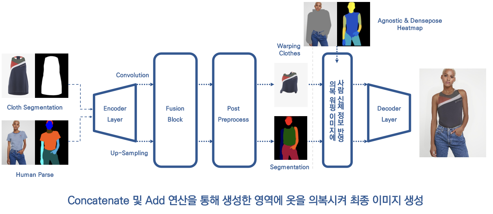

## 🧩 전처리 과정

#### 0. 데이터셋 구축

AI Hub "패션상품 및 착용 영상" 이미지 데이터를 가공하여 학습을 위한 데이터셋 구축

- 상품 이미지 (앞, 뒤) : Train Set 33,170 | Test Set 7,989
- 착용 이미지 (정면 포함 회전) : Train Set 93,068 | Test Set 11,629
- 정면 상품 및 착용 이미지를 추출하고, 착용 이미지 파일명 동기화
- 이를 통해 **Train Set 19,289 | Test Set 2,383쌍** 의 데이터셋 구축

#### 1. 이미지 사이즈 변경 (Image Resize)

- 데이터셋 이미지 : 720 * 1280 의 16 : 9 비율 이미지

- HR-VITON 처리 이미지 : 768 * 1024 의 4 : 3 비율 이미지

- 상의 가상 착용을 위한 이미지 확대 및 비율 조정

  

    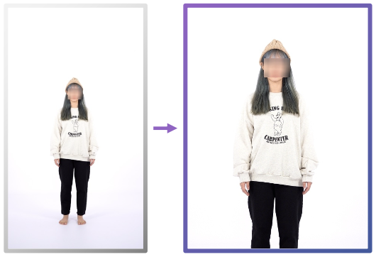
  

#### 2. 옷 형태 추출 (Cloth Mask)

- Carvekit 라이브러리를 사용하여 옷의 형태 추출

- Segmentation 기술을 사용하여 가상 착용하는 옷의 크기를 정확하게 파악하고 분리하는 과정

  

    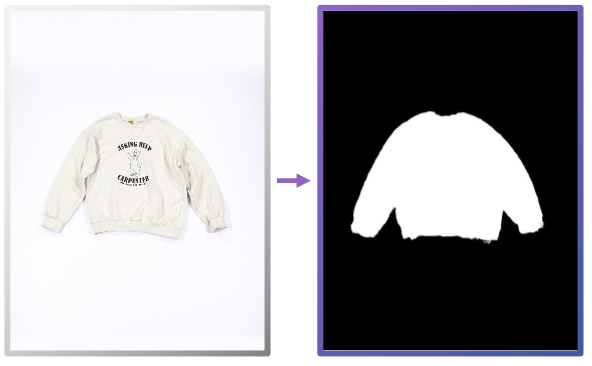
  

#### 3. 옷의 밀도 및 각도 식별 (Densepose)

- Detectron2 라이브러리를 사용하여 옷의 밀도와 각도를 식별

- 신체와 옷의 일치 여부를 더욱 정확하게 파악

  

    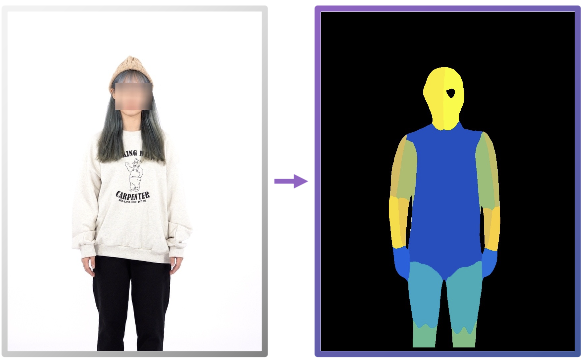
  

#### 4. 옷의 종류 및 신체 부위 식별 (Human Parse)

- CIHP_PGN 라이브러리를 사용하여 옷의 종류와 신체 부위 식별

- 옷과 신체에 대한 정보를 담은 Parsing Map 을 출력

  

    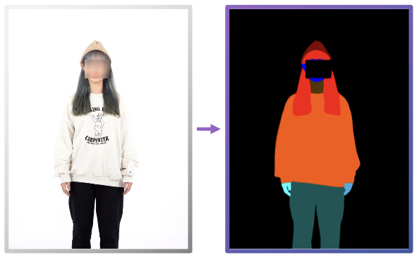
  

#### 5. 스켈레톤 추출 (Openpose)

- Openpose 라이브러리를 사용하여 스켈레톤을 감지하고 추정

- 인간 자세 예측의 한 분야로 인체의 움직임을 추출하고 추적

- 스켈레톤 정보를 포함한 img/json 파일을 생성

  

    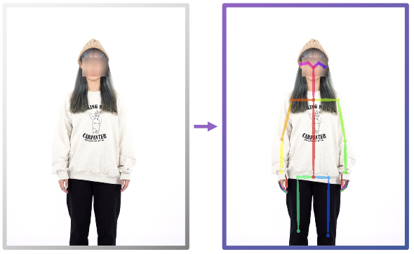
  

#### 6. 가상 착용 영역 추출 (Parse Agnostic)

- 입력 이미지의 신체 부분만 추출하고, 의복 영역은 제거

- Openpose의 JSON 파일을 통해 스켈레톤 구조를 파악하여 의복 영역에 구애받지 않고 가상착용을 가능하게 해줌

  

    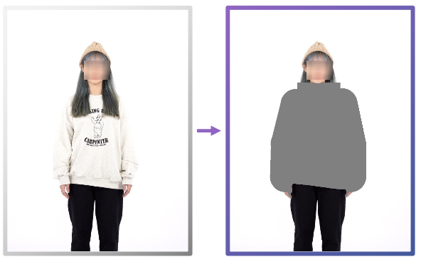
  

  
  

## ✏️ 모델 학습

#### 1. NVIDIA RTX 2080 GPU 메모리 에러 발생 (8GB)

  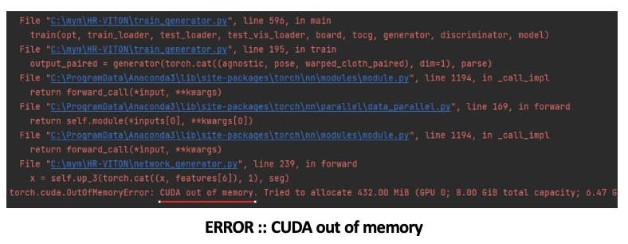

##### Hyper Parameter

> - Batch Size : 1
> - Train Step : 1000
> - Save Step : 200
> - Learning Rate : 0.0002
> - ACC : Default

Batch Size 최소화, `torch.no grad()` 등의 조치에도 에러 해결 실패

#### 2. CPU 학습 시

학습은 가능했지만, 1장의 이미지를 학습하는 데 약 40초 소요

  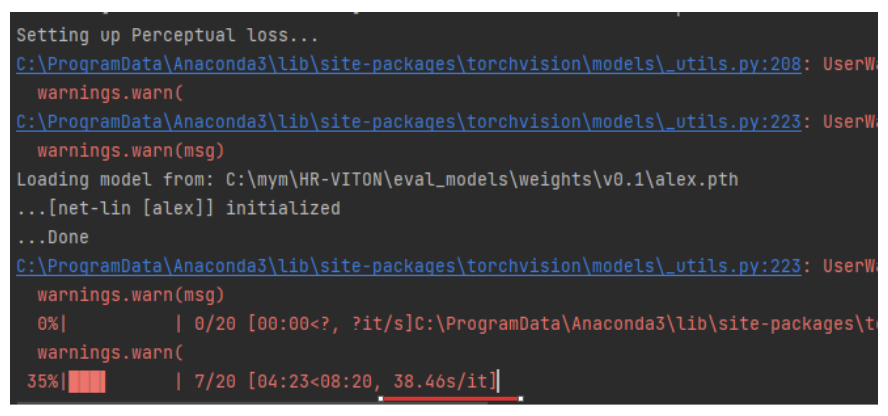

#### 3. HR-VITON 오픈소스 모델 활용 이미지 처리 진행

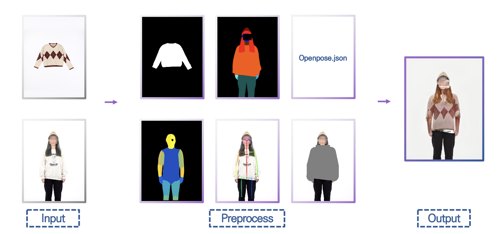

## 🖥️ 웹 / 앱 구현

#### 1. React

사용자가 이미지를 업로드하면, 이미지 전처리를 수행하고, 결과물을 다운로드 받을 수 있는 간단한 화면 구성

  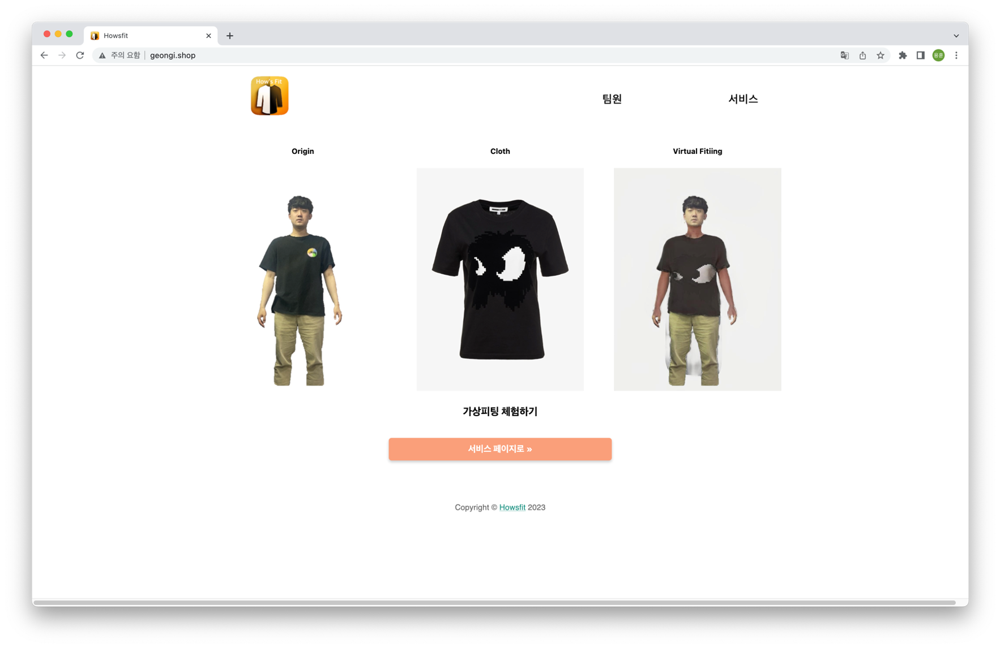
  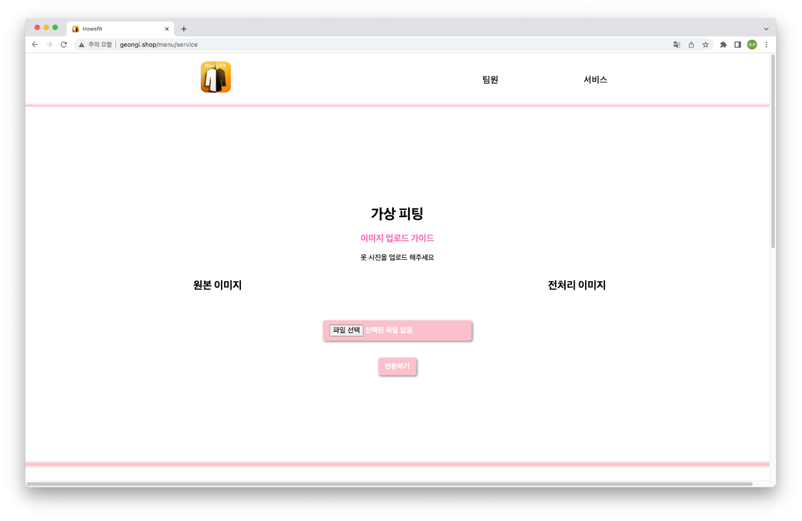
  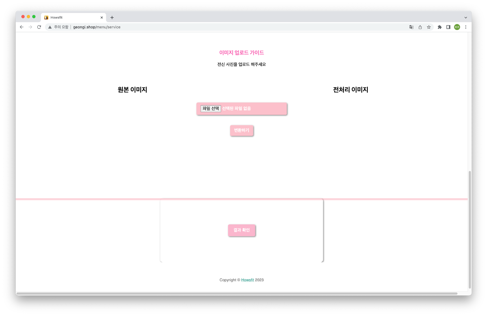

#### 2. Flutter

사진첩에서 상품 이미지와 착용 이미지를 선택하여 업로드하면, 로딩 후 결과물을 보여주는 화면 제작

  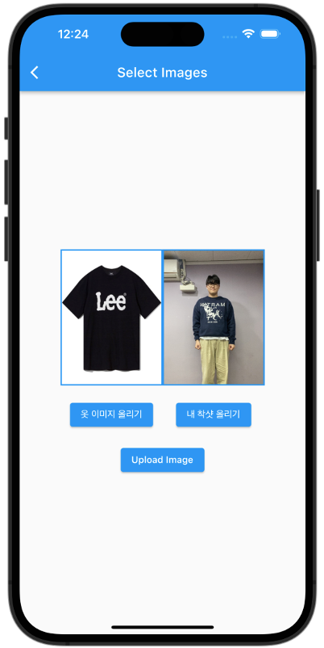
  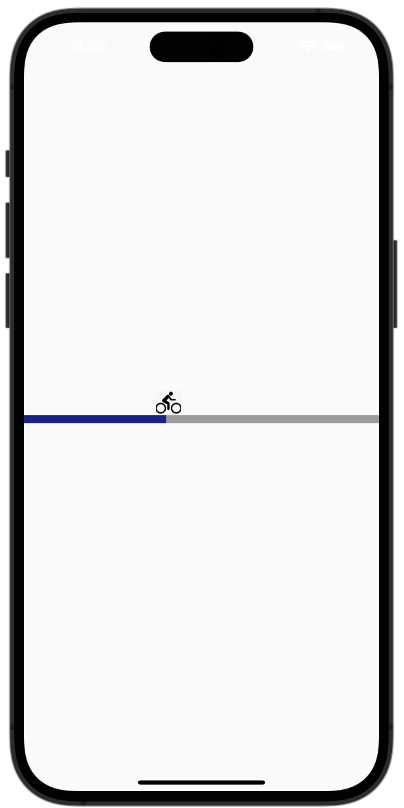
  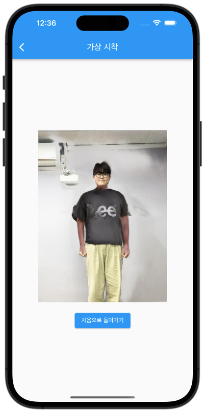

## 📡 서버 구축

#### 1. 개발환경 구축

- 나머지 개발환경
  - Torch 1.10.0
  - Python 3.8 or 3.9
  - NVIDIA CUDA Toolkit 11.1

- ~~Human Parse (CIHP_PGN)~~
  - Tensorflow 1.15
  - Python 3.6 or 3.7
  - NVIDIA CUDA Toolkit 10.0

**Python 및 NVIDIA Toolkit 버전 이슈에 따라 가상환경 분리를 시도했으나 환경 구축 실패**

**이에 따라, Human Parse 전처리 과정을 위해 Graphonomy-master 패키지로 변경**

#### 2. AWS Lightsail 서버 구축

> AWS Lightsail 서버를 사용한 이유?

- EC2 GPU 서버 배포 시 비용적 부담 증가 (시간당 약 2$ 소요)
- 하지만, GPU 사용이 불가하므로 CPU를 통한 이미지 처리 필요
- 이 과정에서 Openpose cpu는 ubuntu16.04 이하에서 사용 가능하여 Posenet 라이브러리로 변경

#### 3. 최종 파이프라인 구축

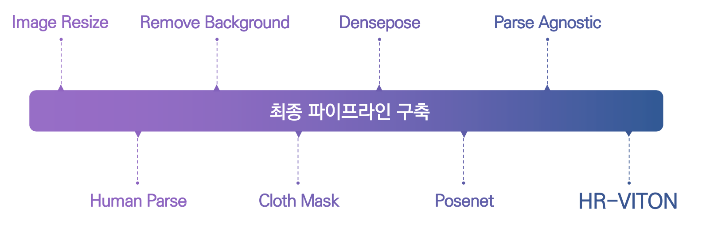

#### 4. 최종 소요시간

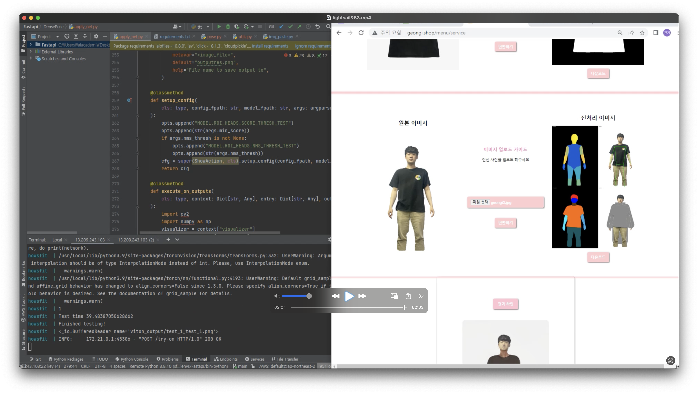

**GPU 미사용에 따라 소요시간이 2배로 증가하여 약 2분 정도 소요**

